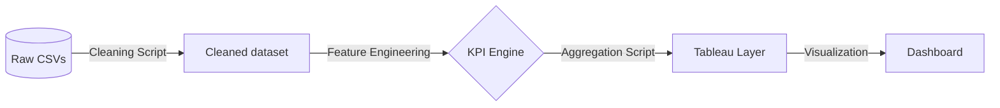

# 📖 Data Dictionary & KPI Framework

This document defines the schema, technical types, and business logic for the US Flight Operations dataset (2015).

---

## 🛰 Data Lineage (ETL Flow)
How data moves through Group-19's pipeline.

---

## 🛠 Raw Data Asset Inventory
| Column Name | Type | Business Definition |
| :--- | :--- | :--- |
| `YEAR`, `MONTH`, `DAY` | Integer | Temporal components of the flight record |
| `AIRLINE` | String | Carrier IATA Code (e.g., AA, DL) |
| `ORIGIN_AIRPORT` | String | Departure Airport IATA Code |
| `DEPARTURE_DELAY` | Float | Variance between scheduled and actual takeoff (min) |
| `ARRIVAL_DELAY` | Float | Variance between scheduled and actual touchdown (min) |

---

## 🧪 KPI Reference Guide
| Metric | Formula / Logic | Threshold |
| :--- | :--- | :--- |
| **OTP Rate** | `(Arrival_Delay <= 15) / Total_Flights` | Target > 80% |
| **Delay Severity** | `Categorization based on arrival delay bins` | N/A |
| **Cancel Rate** | `(Cancelled == 1) / Total_Flights` | Target < 2% |

---

## 🗃 Sample Integrity Note
The current version of `data/raw/flights.csv` is a randomized **100,000-row sample** to ensure IDE performance and notebook stability. The original full dataset (5.8M rows) is archived as `flights_full.csv.bak`.
